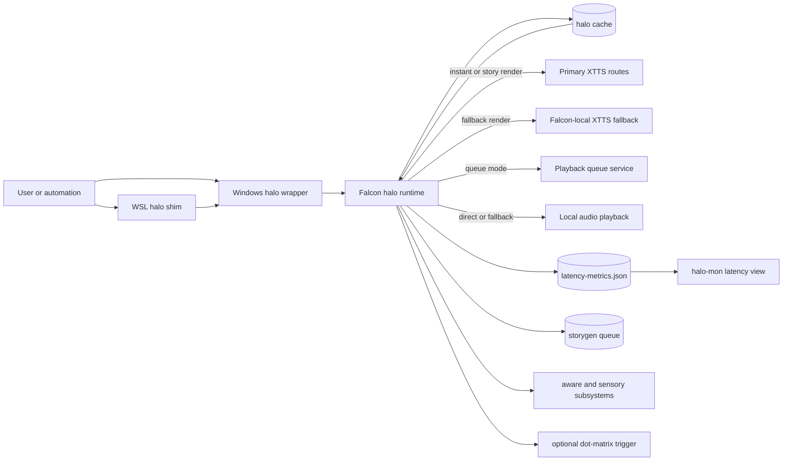
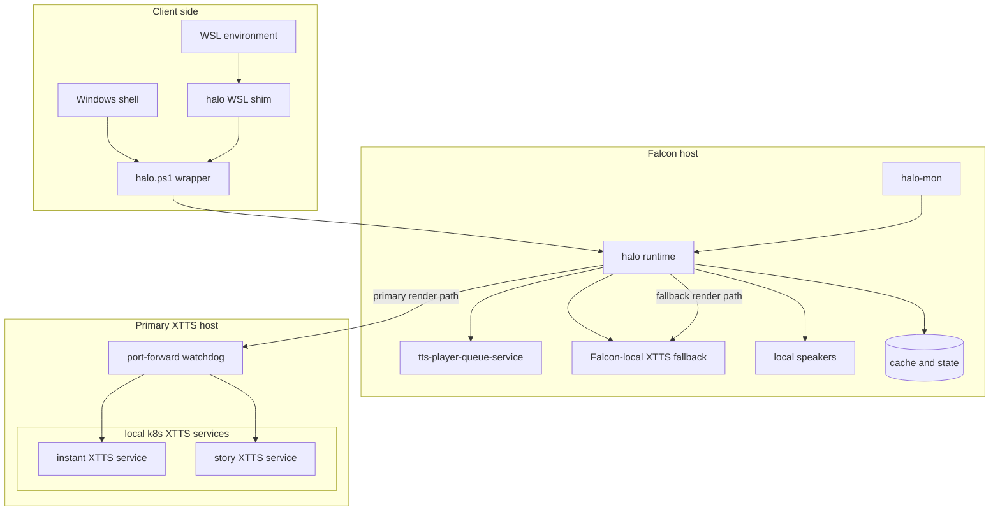

# TTS Pipeline

This repository now serves two roles:

- the active HAL-006 voice runtime built around the `halo` script, XTTS routing, story generation, playback arbitration, latency tracking, and related operator tooling
- a set of older Go TTS daemons that are still useful for experimentation and historical reference

If you are operating the current system, start with `halo`, not the legacy Go daemons.

## Current System

The current production-oriented path is the `halo` runtime in this repo. It is responsible for:

- selecting XTTS render endpoints with primary and fallback behavior
- caching rendered WAV output by request class
- rendering stories either as single WAV files or chunked playlists
- dispatching playback through the queue service or falling back to local playback
- recording per-request latency snapshots for `halo -l` and `halo-mon`
- generating new stories through the OpenAI Responses API
- driving aware-mode and sensory workflows
- optionally triggering dot-matrix visualization from completed audio

The companion `hal` pipeline is separate and should be treated as independent infrastructure. The details are in [docs/architecture/voice-architecture.md](docs/architecture/voice-architecture.md).

## Deployment Guardrails

This repo now carries a machine-readable deployment contract at `deployment-contract.json`.

Use it as the first source of truth when changing:

- Falcon host runtimes such as `/usr/local/bin/halo` and `/usr/local/bin/hal`
- Falcon K3s deployment assets for `hal-tts` and XTTS support paths
- Windows wrapper and port-forward tooling under `tools/`
- cross-repo integration points such as playback queue submission and dotmatrix spool writes

Validate it locally with:

```bash
python3 scripts/validate_deployment_contract.py
```

The workflow and operator rules are documented in [docs/deployment-contract.md](docs/deployment-contract.md).
The manual and GitHub-driven deploy flow is documented in [docs/deployment-workflow.md](docs/deployment-workflow.md).

## Command Surface

The `halo` command currently supports:

```bash
halo "your message here"
halo -l [--json]
halo --render-only "sentence"
halo /?
halo speak
halo read <story-name|filename.txt|/full/path/to/file.txt>
halo --render-only read <story-name|filename.txt|/full/path/to/file.txt>
halo review <filename.txt|/full/path/to/file.txt>
halo --render-only review <filename.txt|/full/path/to/file.txt>
halo list-stories
halo vq
halo storygen [-mw max_words] [optional topic]
halo storygen -pc minutes [topic]
halo storygen -rc
halo story-gen [-mw max_words] [optional topic]
halo story-gen -pc minutes [topic]
halo sg [-mw max_words] [optional topic]
halo sg -pc minutes [topic]
halo --render-only storygen [-mw max_words|-pc minutes] [optional topic]
halo aware on|off|status
halo aware trigger [commentary|observation|monologue|story] [optional topic]
halo aware tick
halo sensory status
halo sensory scan [host|network|photoprism|blink|all]
halo sensory commentary [host|network|photoprism|blink|all]
```

The most common operator flows are:

- ad-hoc speech: `halo "statement"`
- commentary sample: `halo speak`
- read a story with playback: `halo read story-name`
- render a story into cache only: `halo --render-only read story-name`
- have HAL review a text file in character: `halo review ./notes/essay.txt`
- render a HAL review into cache only: `halo --render-only review ./notes/essay.txt`
- inspect recent latency data: `halo -l`
- list story files and cache status: `halo list-stories`
- watch the live story queue: `halo vq`
- generate a new story request and return the request id immediately: `halo storygen`
- generate a long-form podcast script for a target duration: `halo story-gen -pc 30 "this is the topic I want HAL to speak about"`
- pre-render all uncached stories: `halo storygen -rc`

## Runtime Architecture

At a high level, the active `halo` flow is:

```text
client -> halo wrapper -> Falcon-side halo runtime -> XTTS primary/fallback -> cache -> playback queue or local playback
```

### Architecture Diagram



More specifically:

1. The local client forwards arguments to the Falcon-side `halo` runtime.
2. The runtime classifies the request as instant or story.
3. Cache lookup runs before any render request.
4. If there is no cache hit, `halo` calls the XTTS endpoint using the working GET contract:
   `/api/tts?text=...&speaker_id=HAL-006&language_id=en`
5. The rendered WAV is stored in the appropriate cache partition.
6. Playback is sent to the queue service when available, with direct local playback as fallback.
7. A latency snapshot is written for later inspection.

Story reads have an additional branch:

- short stories render to a single WAV file
- longer stories are split into chunk WAVs plus a playlist manifest
- route attribution for chunked stories is merged so the latency view can report `Archos`, `Falcon`, `cache`, or `mixed`

## Key Paths And State

The runtime is centered on `HALO_ROOT`, with these important subdirectories:

- cache root: `cache/halo-xtts/`
- story source files: `story/`
- runtime state: `state/halo/`
- latency state file: `state/halo/latency-metrics.json`
- story generation queue: `state/halo/storygen-queue/`

The story generation queue uses:

- `pending/`
- `processing/`
- `done/`
- `failed/`
- `lock/`

The queue is file-backed so requests survive process restarts cleanly and can be inspected manually when necessary.

Submitting `halo storygen` is non-blocking. The command enqueues the request, starts a detached queue worker, prints the request id, and returns immediately.

## Rendering And Playback

### XTTS routing

`halo` supports explicit primary and fallback XTTS routes for both instant and story requests.

Important variables:

- `HALO_TTS_PRIMARY_HOST`
- `HALO_TTS_ENDPOINT_INSTANT`
- `HALO_TTS_ENDPOINT_STORY`
- `HALO_TTS_ENDPOINT_INSTANT_FALLBACK`
- `HALO_TTS_ENDPOINT_STORY_FALLBACK`
- `HALO_TTS_PRIMARY_ROUTE_LABEL`
- `HALO_TTS_FALLBACK_ROUTE_LABEL`

The intended policy is:

- prefer the primary XTTS host for both instant and story rendering
- fall back to Falcon-local XTTS if the primary route is unavailable
- for story requests, fall through to the instant XTTS route if the dedicated story route is unavailable

The runtime tracks which route actually served the render rather than just which route was preferred.

### Playback arbitration

Playback is controlled by:

- `HALO_PLAYBACK_MODE`
- `HALO_PLAYBACK_QUEUE_ENDPOINT`
- `HALO_PLAYBACK_QUEUE_HEALTH_ENDPOINT`
- `HALO_PLAYBACK_QUEUE_CONNECT_TIMEOUT`
- `HALO_PLAYBACK_QUEUE_MAX_TIME`

Behavior:

- `queue` mode tries the playback queue service first
- if queue health or queue submission fails, playback falls back to local `paplay` or `aplay`
- `direct` mode skips queue playback entirely and plays locally

Latency snapshots label playback as one of:

- `queued`
- `local`
- `local_fallback`

## Cache Design

Cache lookup keys include both format versioning and trailing-silence tuning so older WAVs are not silently reused after format changes.

Important variables:

- `HALO_TTS_CACHE_FORMAT_VERSION`
- `HALO_TTS_TAIL_FADE_MS`
- `HALO_TTS_TRAILING_SILENCE_MS`

Cache layout:

- instant utterances: `cache/halo-xtts/instant/`
- commentary samples: `cache/halo-xtts/commentary/`
- single-file story renders: `cache/halo-xtts/story/single/`
- chunked story bundles: `cache/halo-xtts/story/bundles/<story-hash>/`

Naming policy:

- cached instant, commentary, and chunk WAV files use GUID filenames
- assembled bundle WAV files use slugs derived from the story filename
- cache lookup is maintained through per-bucket index files rather than `.txt` sidecars

Chunked story bundle directories contain the playlist manifest, the individual chunk WAV files, and a background-built assembled WAV for operator use.

## Story Reading And Generation

### Story reads

`halo read` accepts:

- a bare story name without `.txt`
- a story filename under the story directory
- a full path to a story file

Chunking is driven by:

- `HALO_STORY_READ_MAX_CHARS`
- `HALO_STORY_READ_MAX_WORDS`

If a story exceeds either threshold, `halo` splits it into paragraphs and smaller sentence groups before rendering.

`halo list-stories` shows:

- modification timestamp
- whether the story is fully cached
- the story filename

For chunked stories, a `YES` cache label means the playlist exists and every referenced WAV exists.

Chunk playback still uses the per-chunk queue path. The assembled story WAV is a convenience artifact for operators and is not used by the playback queue.

### Story generation

Story generation uses the OpenAI Responses API and requires `OPENAI_API_KEY` to be present in the runtime environment.

Relevant variables:

- `OPENAI_API_KEY`
- `OPENAI_API_URL`
- `OPENAI_MODEL`
- `HALO_STORYGEN_ENV_FILE`
- `HALO_STORYGEN_PROMPT_FILE`
- `HALO_STORYGEN_PROMPT`
- `HALO_STORYGEN_WAIT_SECONDS`

Behavior:

- `halo storygen` enqueues a request and waits for completion
- generated story text is written into the story directory
- generated stories are immediately rendered into cache
- `-mw` enforces a max-word limit on the saved text
- `-pc` switches generation to podcast mode and converts minutes to an approximate word limit using `1000 words ~= 9 minutes`
- `storygen -rc` walks the existing story directory and renders only the uncached stories

The default story prompt is defined in the runtime, but you can override it with either an environment variable or a prompt file under the state/story tree.

## Prompt Files

The editable prompt files used by `halo` now live under:

- `prompts/halo/`

This directory contains the default instruction text for:

- story generation
- podcast generation
- aware-mode system and kind-specific guidance
- review precheck classification
- review generation and review length guidance

`halo` still assembles runtime context such as timestamps, topics, continuity summaries, and source text in code, but the static model instructions are now file-backed so you can inspect and edit them directly.

## Latency And Monitoring

`halo` persists the latest latency snapshot plus a rolling recent history at:

- `HALO_LATENCY_STATE_FILE`

The default file is:

- `state/halo/latency-metrics.json`

`halo -l` prints a human-readable summary including:

- request name and class
- render route
- playback path
- cache hit state
- chunk count
- text length
- stage bars for client transport, cache lookup, render request, audio prepare, WAV dispatch, and total time
- recent sparkline trends

`halo -l --json` prints the raw JSON payload for integration with other tools.

`halo-mon` consumes the same latency data via `halo -l --json` and now includes a dedicated latency tab.

## Aware Mode And Sensory

The runtime includes two higher-level subsystems.

### Aware mode

`halo aware` manages runtime state for autonomous commentary and prompt-driven outputs.

State files live under `state/halo/` and include:

- aware mode state
- aware memory database
- aware summary text
- trigger configuration
- aware output directory

This file-backed and SQLite-backed model is the current implementation. The target replacement architecture for durable identity, episodic memory, imported learning material, and Qdrant-backed retrieval is documented in `docs/architecture/aware-state-system.md`, with the initial Postgres schema in `db/halo_state_postgres.sql` and sample runtime configuration in `config/halo-state.env.example`.

State tooling now lives under `halo_state/` and can be called directly with `PYTHONPATH=. python3 -m halo_state.cli ...`.

Useful commands:

- `PYTHONPATH=. python3 -m halo_state.cli migrate-legacy-state --aware-db /path/to/aware-memory.sqlite3 --sensory-db /path/to/knowledge.sqlite3`
- `PYTHONPATH=. python3 -m halo_state.cli migrate-legacy-state --commentary-db /path/to/commentary-history.sqlite3`
- `PYTHONPATH=. python3 -m halo_state.cli ingest-learning-material`
- `PYTHONPATH=. python3 -m halo_state.cli refresh-summary --summary-file /path/to/aware-summary.txt --entry-limit 12 --max-chars 1800`

Python dependencies for the new state layer are listed in `requirements-state.txt`.

For a local self-contained development stack, use `docker-compose.halo-state.yml` and `tools/bootstrap-halo-state.ps1`.

### Sensory

`halo sensory` runs Python-based sensors and commentary selection.

Supported sensors currently include:

- `host`
- `network`
- `photoprism`
- `blink`

The Python entrypoint is controlled by `HALO_SENSORY_PYTHON`, and the sensory code lives under `sensory/`.

## Dot-Matrix Integration

Optional dot-matrix triggering is available after successful audio handling.

Relevant variables:

- `HALO_DOTMATRIX_ENABLED`
- `HALO_DOTMATRIX_QUEUE_DIR`
- `HALO_DOTMATRIX_TRIGGER_COMMAND`
- `HALO_SENSORY_PYTHON`

When enabled, `halo` will try:

1. a dedicated trigger command
2. a Python fallback using `idotmatrix.halo_display_cli`

This is intentionally optional and does not block speech if the display path is unavailable.

## WSL Client

If you want to call `halo` from WSL, install the WSL-side shim from this repo:

```bash
bash /mnt/f/DEVELOPMENT/FALCON_LOCAL/mercury-tts/tools/install-halo-wsl-client.sh
```

That installer places the client at `~/bin/halo` and adds `~/bin` to the WSL shell `PATH` if needed.

The WSL client intentionally does not maintain its own SSH configuration. It delegates to the repo-managed Windows wrapper at `tools/halo.ps1` through `pwsh.exe`, which allows WSL to reuse the already working Windows-side Falcon connection and key setup.

Useful overrides:

- `HALO_WINDOWS_WRAPPER`
- `HALO_WINDOWS_SHELL`

After installation, these should work from WSL:

```bash
halo /?
halo speak
halo list-stories
halo -l
```

## Persistent Primary XTTS Exposure

### Deployment Diagram



On the Windows host that fronts the primary XTTS services, the local Kubernetes services can be exposed persistently to the LAN through the scripts in `tools/`:

- `tools/watch-xtts-portforwards.ps1`
- `tools/install-xtts-portforwards.ps1`

The installer starts a watchdog that keeps the instant and story XTTS service forwards alive.

Persistence model:

- non-elevated install: user-logon startup entry
- elevated install: scheduled task plus firewall rule management

The README intentionally does not pin machine-specific LAN addresses here. Treat the exposed host and port mapping as deployment-specific configuration and keep the actual address in local environment or operator notes.

## Selected Environment Variables

These are the main knobs worth knowing when operating the current system.

### Rendering

- `HALO_TTS_PRIMARY_HOST`
- `HALO_TTS_ENDPOINT_INSTANT`
- `HALO_TTS_ENDPOINT_STORY`
- `HALO_TTS_ENDPOINT_INSTANT_FALLBACK`
- `HALO_TTS_ENDPOINT_STORY_FALLBACK`
- `HALO_TTS_CONNECT_TIMEOUT`
- `HALO_TTS_MAX_TIME_INSTANT`
- `HALO_TTS_MAX_TIME_STORY`

### Playback

- `HALO_PLAYBACK_MODE`
- `HALO_PLAYBACK_QUEUE_ENDPOINT`
- `HALO_PLAYBACK_QUEUE_HEALTH_ENDPOINT`
- `HALO_PLAYBACK_QUEUE_CONNECT_TIMEOUT`
- `HALO_PLAYBACK_QUEUE_MAX_TIME`

### Cache And Story Reads

- `HALO_TTS_CACHE_FORMAT_VERSION`
- `HALO_TTS_TAIL_FADE_MS`
- `HALO_TTS_TRAILING_SILENCE_MS`
- `HALO_STORY_READ_MAX_CHARS`
- `HALO_STORY_READ_MAX_WORDS`

### Story Generation

- `OPENAI_API_KEY`
- `OPENAI_API_URL`
- `OPENAI_MODEL`
- `HALO_STORYGEN_WAIT_SECONDS`
- `HALO_STORYGEN_PROMPT_FILE`
- `HALO_STORYGEN_ENV_FILE`

### Monitoring And Integration

- `HALO_LATENCY_STATE_FILE`
- `HALO_LATENCY_HISTORY_LIMIT`
- `HALO_DOTMATRIX_ENABLED`
- `HALO_DOTMATRIX_QUEUE_DIR`
- `HALO_DOTMATRIX_TRIGGER_COMMAND`
- `HALO_SENSORY_PYTHON`

## Repository Layout

Operator-relevant files and directories:

- `halo`: active HAL-006 runtime
- `hal`: separate voice pipeline entrypoint
- `sensory/`: Python sensory subsystem
- `tools/`: WSL client install and XTTS port-forward watchdog tooling
- `k8s/`: deployment manifests, including XTTS service definitions
- `docs/architecture/voice-architecture.md`: guardrails for the two-pipeline design

## Legacy Go Daemons

This repo still contains several Go daemons:

- `tts_daemon.go`
- `fast_tts_daemon.go`
- `pipeline_tts_daemon.go`
- `instant_tts_daemon.go`
- `fast_tts_streamer.go`

Those files are still useful for testing, experiments, and older deployment paths, but they are not the best description of the current `halo` runtime architecture.

At a glance:

- they assume local Coqui-style endpoints such as `localhost:5002`
- they focus on direct daemon-style rendering and playback
- they do not describe the newer `halo` cache, routing, latency, sensory, or storygen behavior

## Troubleshooting

### `halo -l` shows no data

- run one `halo` request first
- check that `HALO_LATENCY_STATE_FILE` points to a writable path
- confirm the Falcon-side `halo` runtime is the updated script, not an older copy

### Story render seems to use the wrong backend

- inspect `halo -l` after a render-only request
- check the reported `Render route`
- verify the primary and fallback XTTS endpoints are set as intended

### Queue playback is not being used

- verify the queue health endpoint resolves from Falcon
- inspect `HALO_PLAYBACK_MODE`
- check whether `halo` is reporting `Playback: local fallback`

### `halo storygen` fails immediately

- confirm `OPENAI_API_KEY` is set in the runtime environment or storygen env file
- confirm the prompt file path exists if you override it
- inspect the request directory under `state/halo/storygen-queue/failed/`

### WSL `halo` does not work

- verify `pwsh.exe` is available through WSL interop
- verify the Windows wrapper path is still correct
- rerun `tools/install-halo-wsl-client.sh`

## Additional Documents

- [docs/architecture/voice-architecture.md](docs/architecture/voice-architecture.md)
- For the LED matrix integration details, see the `HALO_DOTMATRIX.md` document in the `hal-display` workspace.

## License

This project is licensed under the GNU Affero General Public License v3.0 (AGPL-3.0). See [LICENSE](LICENSE).

- **Response time**: < 5ms for pre-warmed connections
- **Audio playback**: Starts immediately when first chunk is ready
- **Concurrent requests**: Handled with intelligent throttling
- **Memory usage**: Optimized with connection pooling

## Configuration

Key constants in each daemon:

- `ttsURL`: Coqui TTS server endpoint
- `serverPort`: Local daemon port
- `defaultSpeaker`: Default voice profile
- `dragThreshold`: Performance monitoring threshold

## HAL Runtime Routing

The `halo` runtime wrapper in this repo now uses explicit fallback behavior for both rendering and playback.

### XTTS render routes

- Primary XTTS host: `HALO_TTS_PRIMARY_HOST`, default `192.168.1.165`
- Primary instant route: `HALO_TTS_ENDPOINT_INSTANT`, default `http://${HALO_TTS_PRIMARY_HOST}:5003/api/tts`
- Primary story route: `HALO_TTS_ENDPOINT_STORY`, default `http://${HALO_TTS_PRIMARY_HOST}:5004/api/tts`
- Fallback instant route: `HALO_TTS_ENDPOINT_INSTANT_FALLBACK`, default `http://127.0.0.1:5003/api/tts`
- Fallback story route: `HALO_TTS_ENDPOINT_STORY_FALLBACK`, default `http://127.0.0.1:5003/api/tts`

This gives the expected policy of preferring the Archos XTTS pods first and failing over to Falcon-local XTTS only when the Archos route is unavailable.

The persistent local exposure now provides dedicated Archos-side endpoints on `:5003` for instant XTTS and `:5004` for story XTTS, while Falcon fallback remains on the known-good local `:5003` path.

### Persistent local XTTS exposure

On the local Windows host, the Docker Desktop Kubernetes XTTS services can be exposed persistently to the LAN through the watchdog and installer scripts in `tools/`:

- `tools/watch-xtts-portforwards.ps1`
- `tools/install-xtts-portforwards.ps1`

The installer starts a watchdog that keeps these forwards alive:

- `192.168.1.165:5003 -> svc/coqui-xtts-instant-local:5003`
- `192.168.1.165:5004 -> svc/coqui-xtts-story-local:5003`

If the installer is run without elevation, it falls back to an `HKCU\Software\Microsoft\Windows\CurrentVersion\Run` entry so the watchdog restarts automatically after reboot when the user logs in.

If you want the forwards to come up before user logon and also want firewall rules managed automatically, run the installer from an elevated PowerShell session so it can register the scheduled task and inbound firewall rules.

### WSL halo client

If you want to call `halo` from WSL, install the WSL-side shim from this repo:

```bash
bash /mnt/f/DEVELOPMENT/FALCON_LOCAL/mercury-tts/tools/install-halo-wsl-client.sh
```

That installer places the client at `~/bin/halo` and adds `~/bin` to the WSL shell `PATH` if needed.

The WSL client does not maintain its own SSH configuration. Instead, it delegates to the repo-managed Windows wrapper at `tools/halo.ps1` through `pwsh.exe`, so it reuses the already working Windows-side Falcon connection and key setup.

After installation, these work from WSL:

```bash
halo /?
halo speak
halo list-stories
halo -l
```

### Playback arbitration

- Playback mode is selected by `HALO_PLAYBACK_MODE`, default `queue`
- Queue endpoint: `HALO_PLAYBACK_QUEUE_ENDPOINT`, default `http://127.0.0.1:18080/api/tts/play`
- Queue health endpoint defaults to `${HALO_PLAYBACK_QUEUE_ENDPOINT%/api/tts/play}/health` unless `HALO_PLAYBACK_QUEUE_HEALTH_ENDPOINT` is set explicitly

When playback mode is `queue`, `halo` will submit rendered WAV files to the full playback queue service first. If the queue service is unavailable or queue submission fails, `halo` always falls back to direct local playback via `paplay` or `aplay`.

This fallback is intentional and required so speech still works when the queue service is down or not yet started.

### Cache versioning

`halo` cache keys include both:

- `HALO_TTS_CACHE_FORMAT_VERSION`
- `HALO_TTS_TAIL_FADE_MS`
- `HALO_TTS_TRAILING_SILENCE_MS`

This prevents older cached WAV files without the current tail smoothing and trailing-silence mitigation from being reused after the cache format changes.

### Cache layout

The `halo` runtime now partitions cache entries by category instead of writing all WAV and mapping files into one flat directory.

- Instant or ad-hoc utterances: `cache/halo-xtts/instant/`
- Commentary samples from `halo speak`: `cache/halo-xtts/commentary/`
- Single-file story renders: `cache/halo-xtts/story/single/`
- Chunked story bundles: `cache/halo-xtts/story/bundles/<story-hash>/`

Each chunked story bundle gets its own subdirectory containing the playlist manifest and the chunk WAV/text pairs for that one story. This keeps bundle assets isolated from commentary and one-off speech cache entries and makes story cache inspection and retrieval more predictable.

To pre-render all currently uncached stories into that partitioned story cache without playback, use `halo storygen -rc`.

## Development

### Adding New Voice Profiles

Modify the speaker parameter in client calls or daemon defaults.

### Performance Tuning

Adjust connection pool sizes, timeouts, and concurrent limits based on your hardware.

### Monitoring

Use the `/health` and `/stats` endpoints to monitor system performance.

## Troubleshooting

1. **No audio output**: Check `aplay` installation and audio device configuration
2. **Connection refused**: Verify TTS daemon is running on expected port
3. **Slow performance**: Check network connectivity to Coqui TTS server
4. **Memory issues**: Adjust connection pool sizes in daemon configuration

## License

This project is licensed under the GNU Affero General Public License v3.0 (AGPL-3.0) - see the [LICENSE](LICENSE) file for details.

This ensures the software remains free and open source, while protecting against proprietary commercial use without contribution back to the community.
