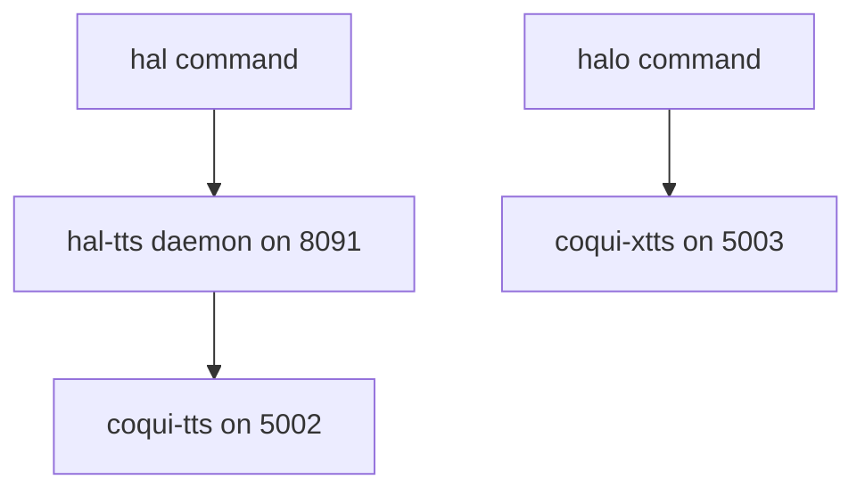

# Voice Architecture

This repository uses two separate voice pipelines. Changes to one should not be assumed safe for the other.

## Overview



## `hal` Path

- command: `hal`
- purpose: fast streaming voice
- speaker: `p254`
- route: `hal -> hal-tts -> coqui-tts`

## `halo` Path

- command: `halo`
- purpose: cloned HAL-006 voice
- route: `halo -> coqui-xtts`
- slower than `hal`, but the intended path for dramatic or characterful speech

## Shared Resources

- shared TTS model storage
- HAL-006 reference audio for XTTS
- optional PulseAudio output on Falcon for local playback

## Guardrails

- do not change the `hal` route when the work only targets `halo`
- do not change XTTS assumptions when the work only targets `hal`
- treat the queue service and local playback as separate concerns from synthesis

## Troubleshooting

### `hal` voice

```bash
curl http://localhost:8091/health
```

### `halo` voice

```bash
curl http://localhost:5003/
```