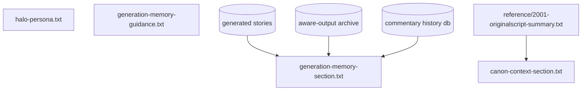
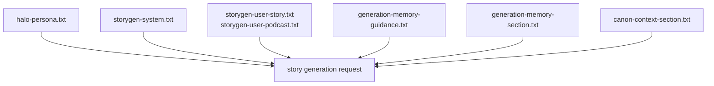
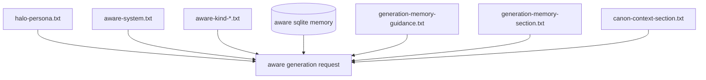
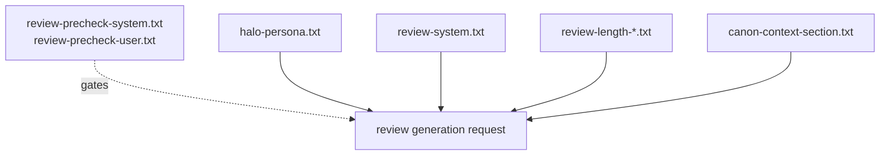

# HALO Prompt Guide

This directory contains the active prompt files that shape HAL generation.

## Active Files

- `halo-persona.txt`: shared persona base for story generation, aware generation, and review generation.
- `storygen-system.txt`: story and podcast system-specific guidance layered after the shared persona.
- `storygen-user-story.txt`: user template for standard story requests.
- `storygen-user-podcast.txt`: user template for podcast requests.
- `aware-system.txt`: aware-mode system guidance layered after the shared persona.
- `aware-kind-commentary.txt`: kind-specific instruction for aware commentary.
- `aware-kind-observation.txt`: kind-specific instruction for aware observations.
- `aware-kind-monologue.txt`: kind-specific instruction for aware monologues.
- `aware-kind-story.txt`: kind-specific instruction for aware stories.
- `review-precheck-system.txt`: classifier prompt that gates whether a source should be reviewed.
- `review-precheck-user.txt`: user template for review precheck.
- `review-system.txt`: review generation guidance layered after the shared persona.
- `review-length-short.txt`: short review sizing guidance.
- `review-length-medium.txt`: medium review sizing guidance.
- `review-length-long.txt`: long review sizing guidance.
- `generation-memory-guidance.txt`: rule block describing how prior outputs should be treated as memory.
- `generation-memory-section.txt`: wrapper template for the aggregated previous stories and commentary text.
- `canon-context-section.txt`: wrapper template for the compact 2001 canon summary passed into generation.

## Runtime Context

The code still injects runtime state in addition to these files:

- timestamps and host details
- topic seeds and target lengths
- aware-mode recent and relevant summaries from the SQLite memory store
- prior generated story text from the generated story archive
- prior aware story and commentary artifacts from the aware-output archive
- prior commentary lines recorded in commentary history
- the compact canon summary from `reference/2001-originalscript-summary.txt`

## Prompt Flow

### Shared Inputs

### Story Generation

### Aware Generation

### Review Generation

## Notes

- `review-precheck-*` is intentionally not persona-based. It is a classifier, not a character performance.
- `halo-persona.txt` is the primary shared persona file.
- Keep template placeholders intact in files that use them unless the code is updated too.
