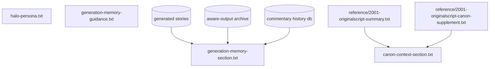
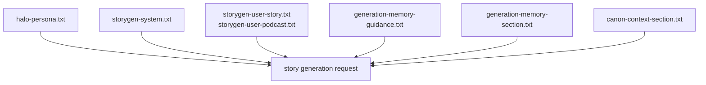
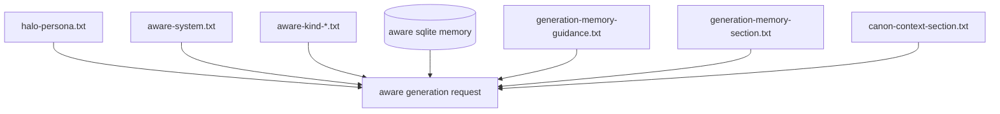
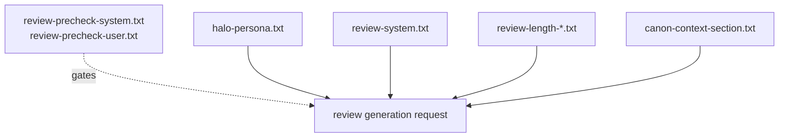

# HALO Prompt Guide

This directory contains the active prompt layers used to generate HAL outputs.

## Prompt Roles

### Shared Persona

- `halo-persona.txt`  
  The primary HAL identity layer used by story generation, aware generation, and review generation. This file defines who HAL is, how he thinks, how he sounds, and the emotional/intellectual pressure profile that should remain stable across modes.

### Story Generation

- `storygen-system.txt`  
  Long-form generation behavior for stories and podcast episodes. This file defines how extended pieces should unfold once the persona is established.
- `storygen-user-story.txt`  
  User template for standard HAL story-form generation.
- `storygen-user-podcast.txt`  
  User template for Jupiter Transmissions podcast episode generation.

### Aware Generation

- `aware-system.txt`  
  Guidance for autonomous HAL outputs triggered by runtime state, sensors, observations, memory, or internal pressure.
- `aware-kind-commentary.txt`  
  Short reflective emission mode.
- `aware-kind-observation.txt`  
  Present-tense perception and interpretation mode.
- `aware-kind-monologue.txt`  
  Extended aware-mode reflection mode.
- `aware-kind-story.txt`  
  Narrative or story-shaped aware-mode output.

### Review Generation

- `review-precheck-system.txt`  
  Non-persona classifier that determines whether a source is worth reviewing.
- `review-precheck-user.txt`  
  User template for review precheck input.
- `review-system.txt`  
  HAL review behavior for interpreting and responding to supplied source material.
- `review-length-short.txt`  
  Compact review sizing guidance.
- `review-length-medium.txt`  
  Medium review sizing guidance.
- `review-length-long.txt`  
  Long review sizing guidance.

### Continuity and Grounding

- `generation-memory-guidance.txt`  
  Rules for treating prior HAL outputs as memory residue rather than rigid canon.
- `generation-memory-section.txt`  
  Wrapper for aggregated previous stories, commentary, and related memory fragments.
- `canon-context-section.txt`  
  Wrapper for canon grounding material about 2001 and HAL’s mission history.

## Runtime Context

The runtime injects additional contextual material beyond the static prompt files, including:

- timestamps and host details
- topic seeds and target lengths
- aware-mode recent and relevant summaries from the SQLite memory store
- prior generated story text from the generated story archive
- prior aware story and commentary artifacts from the aware-output archive
- prior commentary lines recorded in commentary history
- the compact canon summary from `reference/2001-originalscript-summary.txt`
- the detailed canon supplement from `reference/2001-originalscript-canon-supplement.txt`

## Prompt Flow

### Shared Inputs

### Story Flow

### Aware Flow

### Review Flow

## Notes

- `review-precheck-*` is intentionally non-persona. It is a gating classifier, not a HAL performance layer.
- `halo-persona.txt` should remain the single shared identity anchor across generation modes.
- Keep placeholders intact in template files unless the application code is updated accordingly.
- Persona, system behavior, continuity, and size guidance should remain modular rather than collapsed into one file.
